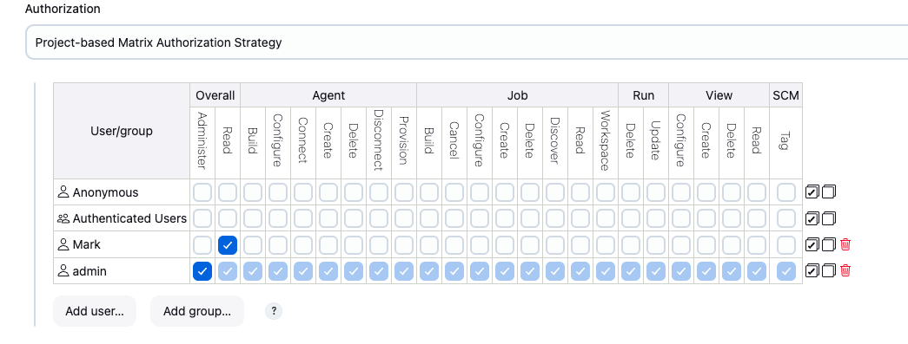
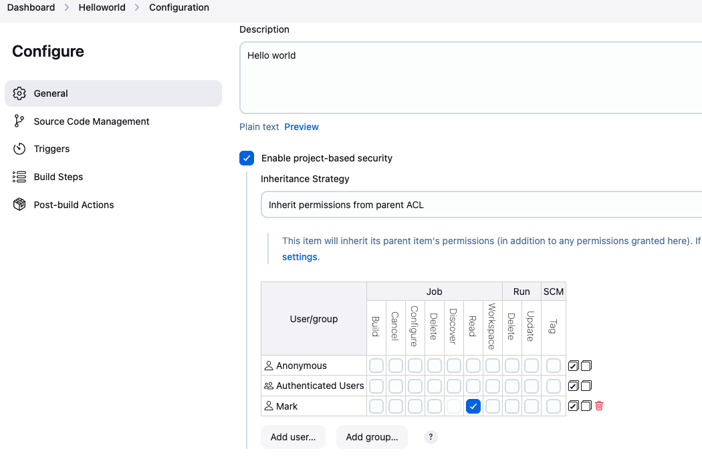

# Configure Jenkins User Access

The Nautilus team is integrating Jenkins into their CI/CD pipelines. After setting up a new Jenkins server, they're now configuring user access for the development team, Follow these steps:

1. Click on the Jenkins button on the top bar to access the Jenkins UI. Login with username `admin` and password `Adm!n321`.

2. Create a jenkins user named `mark` with the password `Rc5C9EyvbU`. Their full name should match `Mark`.

3. Utilize the `Project-based Matrix Authorization Strategy` to assign `overall read` permission to the `mark` user.

4. Remove all permissions for `Anonymous` users (if any) ensuring that the `admin` user retains overall `Administer` permissions.

5. For the existing job, grant `mark` user only `read` permissions, disregarding other permissions such as Agent, SCM etc.

Note:

1. You may need to install plugins and restart Jenkins service. After plugins installation, select Restart Jenkins when installation is complete and no jobs are running on plugin installation/update page.

2. After restarting the Jenkins service, wait for the Jenkins login page to reappear before proceeding. Avoid clicking Finish immediately after restarting the service.

3. Capture screenshots of your configuration for review purposes. Consider using screen recording software like loom.com for documentation and sharing.

## Steps

1. Update required plugins and restart jenkins (check [this](./069.md))
2. Manage Jenkins > Users > Create user > set username, full name, password to create user
3. Manage Jenkins > Plugins > Available Plugins > Search Matrix Authorization Strategy > Install it > restart jenkins
4. Manage Jenkins > Security > Authorization > Select Project-based Matrix authorization Strategy > Update permission like below > save and apply

    

5. Dashboard > HelloWorld > Configuration > Enable Project-based security > add user `mark` > give only read permission > Save and Apply

    

## Good to Know?

### Jenkins Security Model

- **Authentication**: Verify user identity (who you are)
- **Authorization**: Control user permissions (what you can do)
- **Matrix-based Security**: Fine-grained permission control
- **Project-based Security**: Per-project permission settings

### Authorization Strategies

- **Anyone can do anything**: No security (development only)
- **Legacy mode**: Simple logged-in users have full access
- **Matrix-based**: Global permission matrix
- **Project-based Matrix**: Per-project permission matrix

### Permission Types

- **Overall**: Global Jenkins permissions (Administer, Read)
- **Agent**: Build agent management permissions
- **Job**: Job-specific permissions (Build, Configure, Read)
- **SCM**: Source control management permissions

### Security Best Practices

- **Principle of Least Privilege**: Grant minimum required permissions
- **Remove Anonymous Access**: Disable anonymous user permissions
- **Regular Audits**: Review user permissions regularly
- **Role-based Access**: Group users by roles and responsibilities
