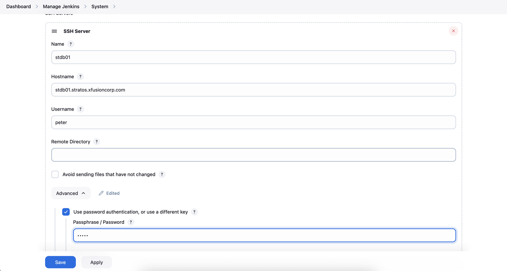

# Jenkins Database Backup Job

There is a requirement to create a Jenkins job to automate the database backup. Below you can find more details to accomplish this task:

Click on the Jenkins button on the top bar to access the Jenkins UI. Login using username admin and password Adm!n321.

1. Create a Jenkins job named `database-backup`.

2. Configure it to take a database dump of the `kodekloud_db01` database present on the `Database server` in `Stratos Datacenter`, the database user is `kodekloud_roy` and password is `asdfgdsd`.

3. The dump should be named in `db_$(date +%F).sql` format, where date `+%F` is the current date.

4. Copy the `db_$(date +%F).sql` dump to the Backup Server under location `/home/clint/db_backups`.

5. Further, schedule this job to run periodically at `*/10 * * * *`(please use this exact schedule format).

Note:

- You might need to install some plugins and restart Jenkins service. So, we recommend clicking on Restart Jenkins when installation is complete and no jobs are running on plugin installation/update page i.e update centre. Also, Jenkins UI sometimes gets stuck when Jenkins service restarts in the back end. In this case please make sure to refresh the UI page.

- Please make sure to define you cron expression like this `*/10 * * * *` (this is just an example to run job every 10 minutes).

- For these kind of scenarios requiring changes to be done in a web UI, please take screenshots so that you can share it with us for review in case your task is marked incomplete. You may also consider using a screen recording software such as loom.com to record and share your work.

## Steps

0. Update plugins and restart jenkins
1. Install the following plugin
    - SSH Credential
    - Publish Over SSH
2. Go to Manage Jenkins > System > Add SSH servers > Apply:

    

3. Create a freestyle job named: `database-backup`:

    - Check build periodically and add this cron job: `*/10 * * * *`
    - Add build step > Send files or execute commands over ssh > add this lines in execute command:

    ```sh
    mkdir -p /tmp/db-backup
    mysqldump -u kodekloud_roy -p'asdfgdsd' kodekloud_db01 > /tmp/db-backup/db_$(date +%F).sql

    ls -la
    sudo apt install sshpass -y

    sshpass -p 'H@wk3y3' scp -o StrictHostKeyChecking=no /tmp/db-backup/*.sql clint@stbkp01:/home/clint/db_backups

    rm -rf /tmp/db-backup
    ```

    > It will create dump, transfer to backup and remove the backup from db server

4. Build job

## Good to Know?

### Database Backup Automation

- **Regular Backups**: Scheduled database dumps for data protection
- **Disaster Recovery**: Quick recovery from data loss
- **Point-in-time Recovery**: Restore to specific time
- **Compliance**: Meet data retention requirements

### MySQL Backup Tools

- **mysqldump**: Logical backup tool (SQL statements)
- **mysqlpump**: Parallel backup utility
- **Percona XtraBackup**: Physical backup tool
- **Binary Logs**: Point-in-time recovery capability

### Backup Best Practices

- **Consistent Naming**: Use timestamps in backup filenames
- **Remote Storage**: Store backups on separate servers
- **Compression**: Reduce backup file size
- **Encryption**: Encrypt sensitive database backups
- **Testing**: Regularly test backup restoration

### Jenkins Backup Jobs

- **Scheduled Execution**: Automated backup scheduling
- **Error Handling**: Notification on backup failures
- **Retention Policy**: Automatic cleanup of old backups
- **Monitoring**: Track backup success and file sizes

## Youtube Video

Watch the video tutorial: [https://youtu.be/KDHXdmdH0nM](https://youtu.be/KDHXdmdH0nM)
