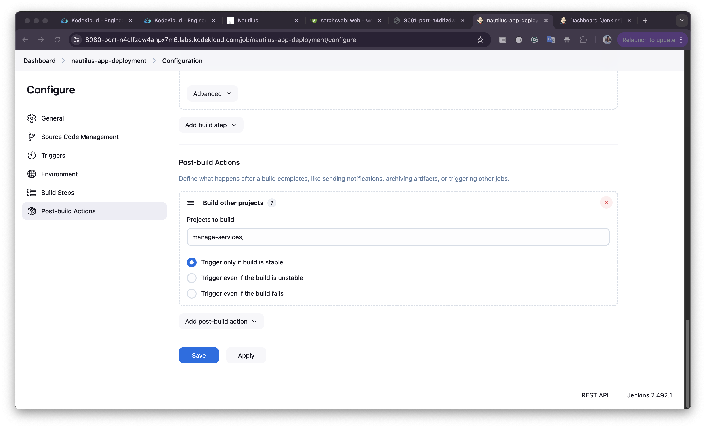

# Jenkins Chained Builds

The DevOps team was looking for a solution where they want to restart Apache service on all app servers if the deployment goes fine on these servers in Stratos Datacenter. After having a discussion, they came up with a solution to use Jenkins chained builds so that they can use a downstream job for services which should only be triggered by the deployment job. So as per the requirements mentioned below configure the required Jenkins jobs.

Click on the Jenkins button on the top bar to access the Jenkins UI. Login using username admin and Adm!n321 password.

Similarly you can access Gitea UI on port 8090 and username and password for Git is sarah and Sarah_pass123 respectively. Under user sarah you will find a repository named web.

Apache is already installed and configured on all app server so no changes are needed there. The doc root /var/www/html on all these app servers is shared among the Storage server under /var/www/html directory.

1. Create a Jenkins job named `nautilus-app-deployment` and configure it to pull change from the master branch of web repository on `Storage server` under `/var/www/html` directory, which is already a local git repository tracking the origin web repository. Since /var/www/html on Storage server is a shared volume so changes should auto reflect on all apps.

2. Create another Jenkins job named `manage-services` and make it a downstream job for `nautilus-app-deployment` job. Things to take care about this job are:

    - This job should restart `httpd` service on all app servers.

    - Trigger this job only if the upstream job i.e `nautilus-app-deployment` is stable.

LB server is already configured. Click on the App button on the top bar to access the app. You should be able to see the latest changes you made. Please make sure the required content is loading on the main URL https://<LBR-URL> i.e there should not be a sub-directory like https://<LBR-URL>/web etc.

Note:

1. You might need to install some plugins and restart Jenkins service. So, we recommend clicking on Restart Jenkins when installation is complete and no jobs are running on plugin installation/update page i.e update centre. Also some times Jenkins UI gets stuck when Jenkins service restarts in the back end so in such case please make sure to refresh the UI page.

2. Make sure Jenkins job passes even on repetitive runs as validation may try to build the job multiple times.

3. Deployment related tasks should be done by sudo user on the destination server to avoid any permission issues so make sure to configure your Jenkins job accordingly.

4. For these kind of scenarios requiring changes to be done in a web UI, please take screenshots so that you can share it with us for review in case your task is marked incomplete. You may also consider using a screen recording software such as loom.com to record and share your work.

## Steps

1. Update plugins and restart jenkins
2. Install following plugins
    - Git
    - Publish Over SSH
3. Add SSH Server, Goto Manage Jenkins > System > SSH Servers > Add Servers:
    Add all 3 app servers with name, hostname, username and password

4. Create primary deployment JOb:
    - Job Name: `nautilus-app-deployment`
    - Type: Freestyle Project
    - SCM: GIT
        - Add Repository URL
    - Build Steps:
        - Shell Execute, and add this line:

        ```sh
        sshpass -p "Bl@kW" scp -r -o StrictHostKeyChecking=no ./* natasha@ststor01:/var/www/html
        ```

5. Create Another Job: manage-services
    - job name: `manage-services`
    - Build Steps: create 3 build steps of `Send or Execute shell over the SSH`
        - For each build step, select each app servers and execution command:

        ```sh
        echo 'app-server-password' | sudo -S systemctl restart httpd
        ```

6. Goto `nautilus-app-deployment` job and add post build action:
    

7. Now build `nautilus-app-deployment` job, once it build successfully manage-services will start building automatically.

8. Reload app link
